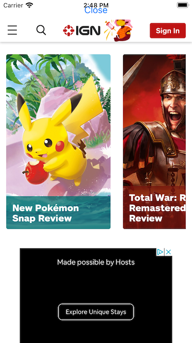

# React Native Challenge

NOTE:

- Pagination is enabled in this implementation.
- For the right "red" color I chose a color picker to find the closet match.
- I Could not find anything about how old an article was in the response from article payload so left that blank.
- There was no webpage in the reponse to the article payload referencing the article so I use the generic ign.com page

There was no webpage in the reponse to the article payload so I use the generic ign.com page

